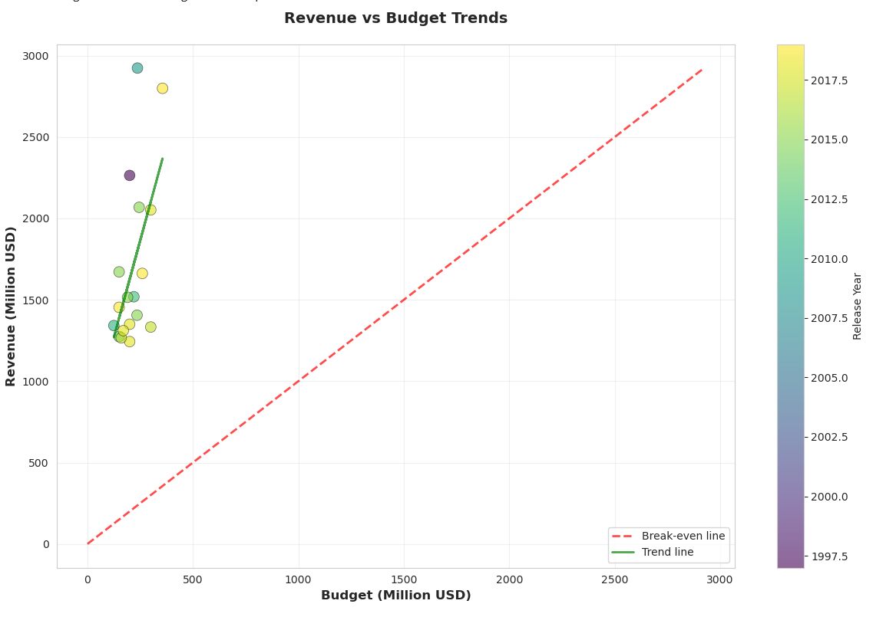
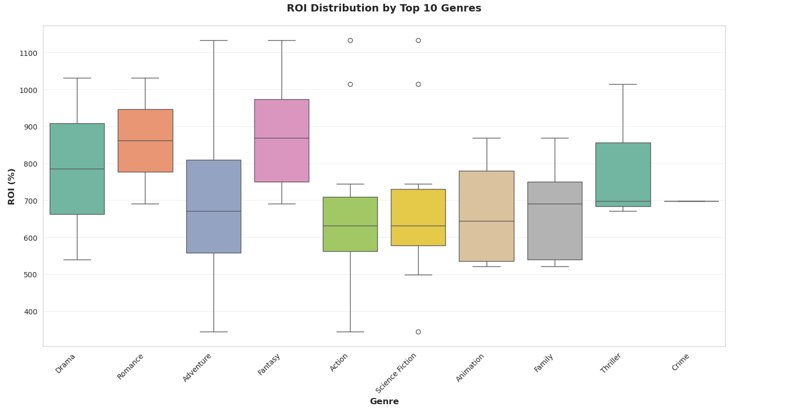
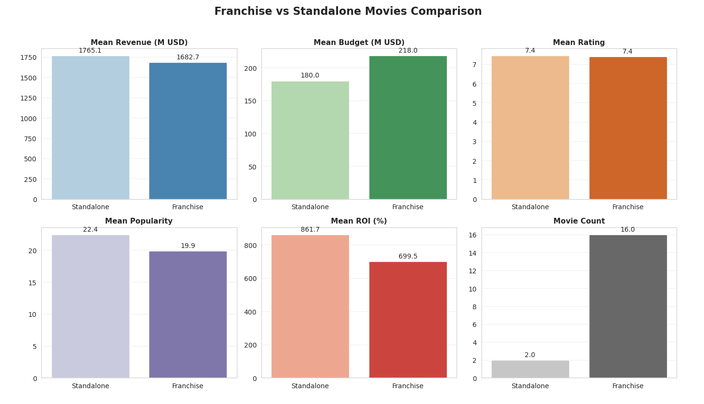
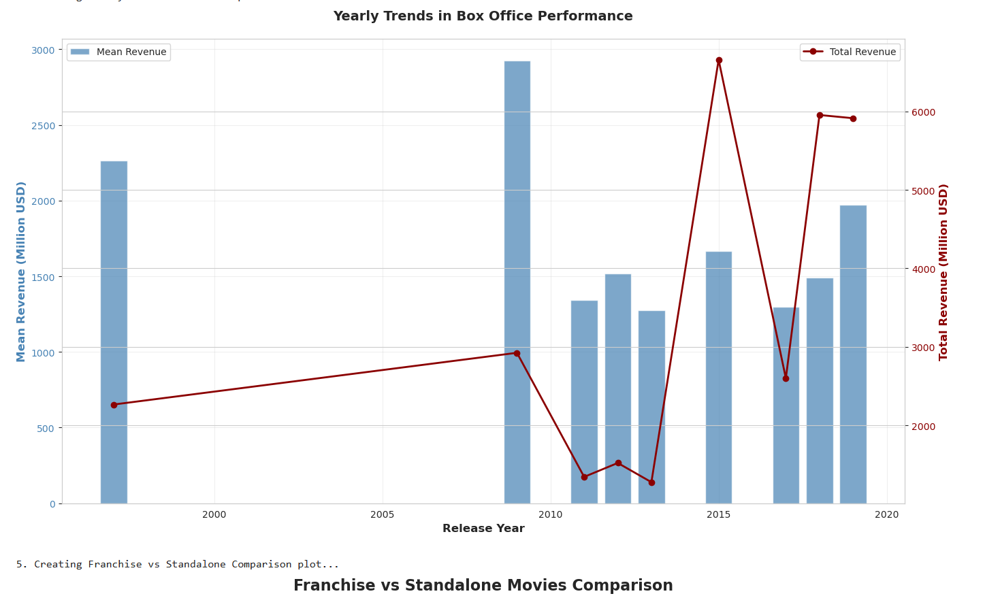
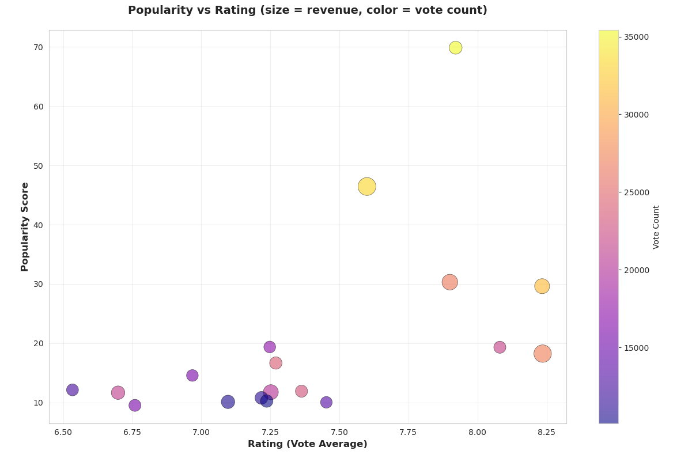

# Exploratory Data Analysis Report

## 1. Revenue vs Budget Analysis

### Insights
*   **Universal Profitability**: All analyzed movies were profitable, as every data point lies above the break-even line (Revenue > Budget).

---

## 2. ROI by Genre Analysis

### Insights
*   **Universal Profitability**: Every genre analyzed is highly profitable, with even the lowest-performing movies returning over 300% ROI.
*   **Best Average Returns**: Romance and Fantasy are the top performers, offering the highest median Return on Investment (approx. 850–900%).

---

## 3. Franchise vs Standalone Analysis

### Insights
*   **Quantity Disparity**: The dataset is overwhelmingly dominated by Franchises (16 movies) compared to just 2 Standalone films.
*   **Standalone Excellence**: Despite their small numbers, Standalone movies slightly outperform Franchises in both average revenue (peaking above $1,750M) and average rating, indicating these specific films were exceptional "lightning in a bottle" hits.
*   **High Floor for Franchises**: Even with a much higher volume of releases, Franchises maintain a massive average revenue (~$1,700M) and strong ratings (~7.4), proving the consistency and reliability of the franchise model.

---

## 4. Yearly Box Office Performance Trends

### Insights
*   **Volume is King**: Total revenue is heavily dependent on the quantity of releases; the historical peaks (2015 and 2018) align perfectly with the years having the highest number of movies (4 releases).
*   **Recent Surge in Output**: There is a distinct shift in activity starting in 2015, breaking the long trend of single-release years (1997–2013) and moving toward a strategy of multiple annual releases.
*   **High Volatility**: Revenue trends are unstable and see-saw dramatically - for instance, revenue crashed by over 60% in 2017 simply because the movie count dropped from 4 to 2.
*   **Lockstep Correlation**: The blue (revenue) and orange (count) lines track each other almost identically, confirming that aggregate growth in this dataset is driven primarily by scaling up production volume rather than just individual movie performance.

---

## 5. Genre Performance Analysis

### Insights
*   **Most Predictable**: Crime has the most consistent performance (narrowest range), making it the "safest" bet.
*   **Highest Potential**: While Action and Adventure have lower medians, they show significant outliers (circles at the top), indicating the highest potential for massive, extreme profits.

---

## 6. Popularity vs Rating Analysis

### Insights
*   **Positive Trend**: There is a clear correlation where higher user ratings generally lead to higher popularity scores, as shown by the upward-sloping trend line.
*   **Engagement Drives Visibility**: The most popular movies (large yellow bubbles at the top) also have the highest vote counts, confirming that mass audience participation is the primary driver of high popularity scores.
*   **The "Blockbuster" Sweet Spot**: Peak popularity is achieved in the 7.5–8.0 rating range rather than at the extreme high end (>8.2), suggesting mainstream hits balance quality with broad appeal rather than perfection.
*   **Quality Doesn't Guarantee Hype**: Movies with the absolute highest ratings (>8.2) often display only moderate popularity (under 25), typical of "critically acclaimed" films that lack viral mainstream reach.
